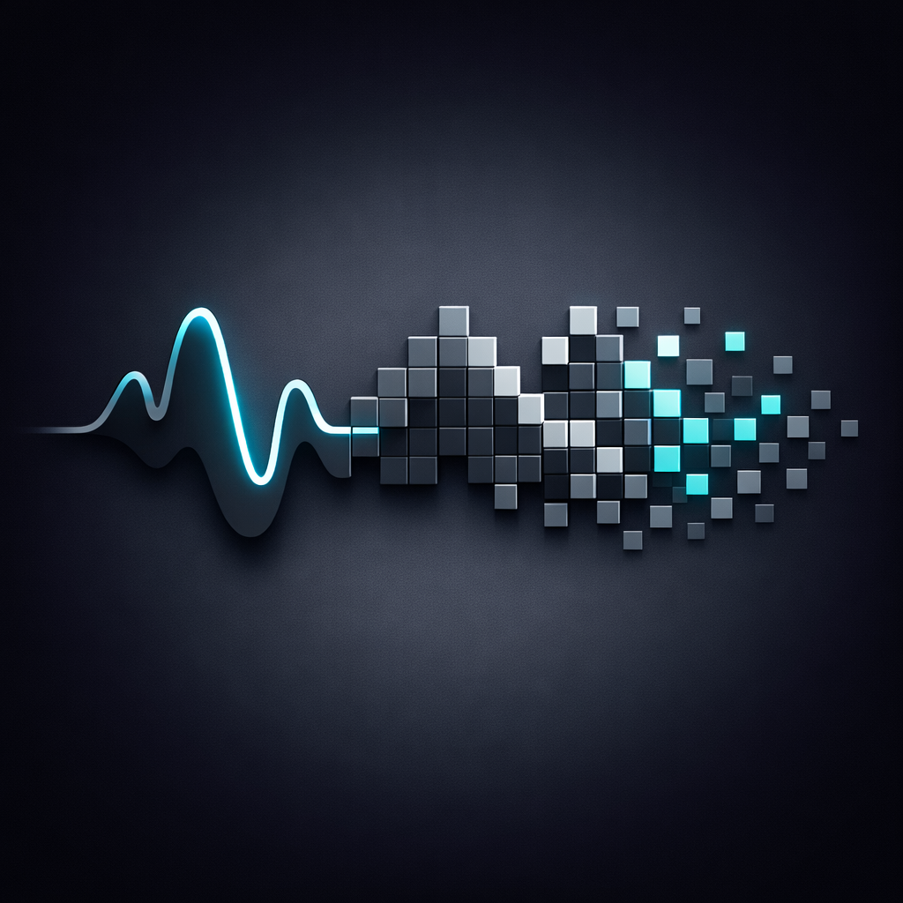
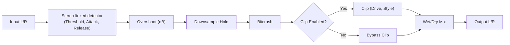

# ThresholdCrush (AU + VST3)

<p align="center">
  
</p>

A macOS audio effect that stays clean under a threshold, then progressively bitcrushes the signal as it exceeds the threshold (like clipping, but with bit-depth reduction).

## Signal Flow
```text
Input
  -> stereo-linked detector (threshold, attack, release)
  -> overshoot drives: downsample-hold -> bitcrush -> optional clip
  -> wet/dry mix
Output
```



## Controls

- **Threshold (dB)**: below this level, the signal is clean.
- **Attack (ms)**: how quickly the detector reacts to overshoot (compressor-like attack). Faster attack = bitcrush engages sooner on transients.
- **Release (ms)**: how quickly the detector recovers after overshoot.
- **Crush Range (dB)**: how many dB above threshold it takes to reach maximum crush (smaller = more aggressive).
- **Min Bit Depth (bits)**: the lowest bit depth reached at maximum overshoot.
- **Downsample Max (x)**: at maximum overshoot, the wet path is sample-held for up to this many samples (1x = off).
- **Clip (toggle)**: optionally add clipping after the crush stages.
- **Clip Drive (dB)**: maximum clip drive at maximum overshoot (actual drive scales with overshoot).
- **Clip Style (%)**: 0% soft (tanh) → 100% hard (clamp).
- **Mix (%)**: dry/wet blend for the crushed signal.

## Presets

Factory presets are available in your host:
- Clean Glue
- Warm Crush
- Lo-Fi Steps
- Bit Smash
- Clipper Bite

## Build (macOS)

```sh
cmake -S . -B build -DCMAKE_BUILD_TYPE=Release
cmake --build build -j 8
```

Build artefacts:
- VST3: `build/ThresholdCrush_artefacts/VST3/ThresholdCrush.vst3` (or `build/ThresholdCrush_artefacts/Release/VST3/ThresholdCrush.vst3`)
- AU:   `build/ThresholdCrush_artefacts/AU/ThresholdCrush.component` (or `build/ThresholdCrush_artefacts/Release/AU/ThresholdCrush.component`)

## Run Tests

```sh
cmake -S . -B build -DTHRESHOLDCRUSH_BUILD_TESTS=ON -DCMAKE_BUILD_TYPE=Debug
cmake --build build -j 8
./build/ThresholdCrushTests_artefacts/ThresholdCrushTests
```

## Install / DAWs

See `INSTALL.md`.

## Package (macOS)

```sh
bash scripts/package_macos.sh
```

The packager auto-detects the version from `CMakeLists.txt` and will build Release if needed.
It also accepts an optional version argument (`0.2.0` or `v0.2.0`).

VST3-only (deprecated, but still available):
```sh
bash scripts/package_macos_vst3.sh
```
